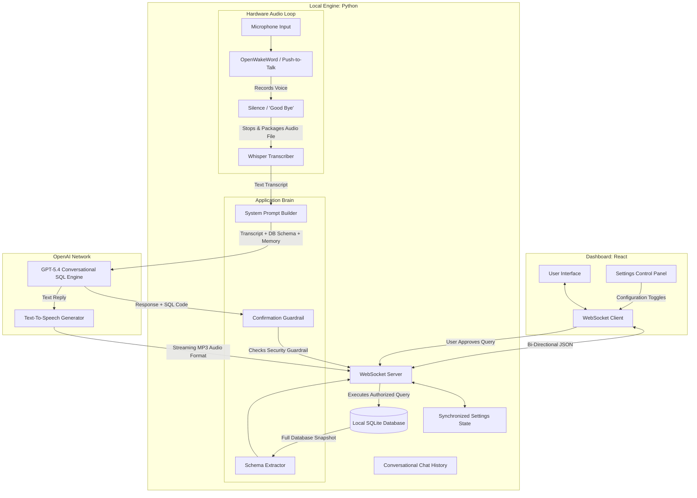

# System Architecture

The TextToSQL application is designed as a local **Audio-First AI Dashboard**. It allows a user to interact with a local database through a modern, split-pane dashboard, combining voice control with a conversational text-to-speech assistant.

## How It Works (The Big Picture)

The application has three main pieces:
1. **The Dashboard (React Frontend):** This is the visual interface you see in your browser. It doesn't process audio; instead, it provides switches and buttons that remotely control the microphone engine, and it displays the data tables you want to look at.
2. **The Local Engine (Python Backend):** This runs firmly on your desktop. It physically connects to your microphone to listen for commands, directly mutates your local SQLite database files, and synchronizes the system.
3. **The AI Brain (OpenAI Ecosystem):** When the system records your voice, it sends the audio off to OpenAI to understand what you said (Whisper), to figure out the database code (GPT-5.4), and to speak a reply back to you (OpenAI TTS).

## System Flow Diagram

## Making Sense of The Core Features

### 1. The Audio Engine
The system's ears are extremely configurable.
- **Activation:** You can choose to leave the microphone entirely open, where it uses a local AI network (`openwakeword`) to listen for "Hey Wallturr" without sending any audio to the cloud. Alternatively, you can toggle a manual "Push-To-Talk" button in the UI.
- **Termination:** Once it starts recording, it needs to know when you've finished your sentence. You can set it to automatically cut off after 2 seconds of silence, manually cut off if you speak a specific "Good Bye" keyword, or both.

### 2. Conversational Memory
The text generator is powered by GPT-5.4. Instead of treating every transcript you speak as a completely new concept, the Python engine maintains a rolling "Chat History" memory array. This allows the AI to remember the last 10 things you discussed, giving you a true conversational back-and-forth experience. 

### 3. Execution Guardrails
It can be dangerous to let an AI mutate your database automatically. The architecture includes a vital **Execution Gate**.
If the "Require Confirmation" setting is toggled **ON**, the AI's generated code gets placed into a staging area. The engine immediately pauses and sends the SQL code to the Dashboard for you to manually inspect. It will absolutely refuse to run the code into the database until it receives an explicit "Approve" signal back from your browser. To ensure memory synchronization, the engine explicitly updates the AI's chat history to let it know whether you ultimately approved or discarded its code! 

If "Require Confirmation" is **OFF**, the code executes locally without pausing.
